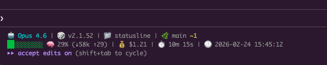

# Claude Code Status Line

A custom status line script for [Claude Code](https://docs.anthropic.com/en/docs/claude-code).



## What it shows

**Line 1:** Model name, version, working directory, git branch with staged/modified counts

**Line 2:** Color-coded context usage bar, token counts, session cost, duration, current date/time

## Requirements

- [jq](https://jqlang.github.io/jq/)

## Setup

1. Copy the script:
   ```bash
   cp statusline.sh ~/.claude/statusline.sh
   chmod +x ~/.claude/statusline.sh
   ```

2. Add to `~/.claude/settings.json`:
   ```json
   {
     "statusLine": {
       "type": "command",
       "command": "~/.claude/statusline.sh"
     }
   }
   ```
