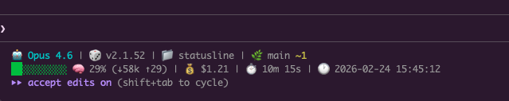

# Claude Code Status Line

A custom status line script for [Claude Code](https://docs.anthropic.com/en/docs/claude-code).



## What it shows

**Line 1:** Model name with effort level, version, working directory, git branch with staged/modified counts

**Line 2:** Color-coded context usage bar, token counts, prompt cache countdown, session cost (API only), subscription usage (5h/7d, Pro/Max only), duration, current date/time

### Prompt cache countdown

Claude Code caches the conversation server-side, and every request resets the cache timer: 1 hour on a Claude subscription within plan usage, 5 minutes with an API key, a cloud provider, or once you draw on usage credits ([details](https://code.claude.com/docs/en/prompt-caching#cache-lifetime)). Once it lapses, the next message (or `/compact`) re-processes the whole context, which is slower and counts against your usage. The segment shows how long the cache stays warm:

- `🔥 47m` — warm, minutes left (green, yellow at ≤25% of the TTL, red at ≤10%)
- `🧊 cold ↻62k` — expired; the next message re-caches ~62k tokens. If that number is large and you don't need the context, starting a fresh session is cheaper.

It needs Claude Code v2.1.251+ (for the `prompt_cache` input) and `refreshInterval` (see below) so the countdown keeps ticking while you're idle.

## Requirements

- [jq](https://jqlang.github.io/jq/)

## Setup

1. Copy the script:
   ```bash
   cp statusline.sh ~/.claude/statusline.sh
   chmod +x ~/.claude/statusline.sh
   ```

2. Add to `~/.claude/settings.json`:
   ```json
   {
     "statusLine": {
       "type": "command",
       "command": "~/.claude/statusline.sh",
       "refreshInterval": 30
     }
   }
   ```

   `refreshInterval` re-runs the script every 30 seconds, which keeps the cache countdown and clock current while the session is idle.
